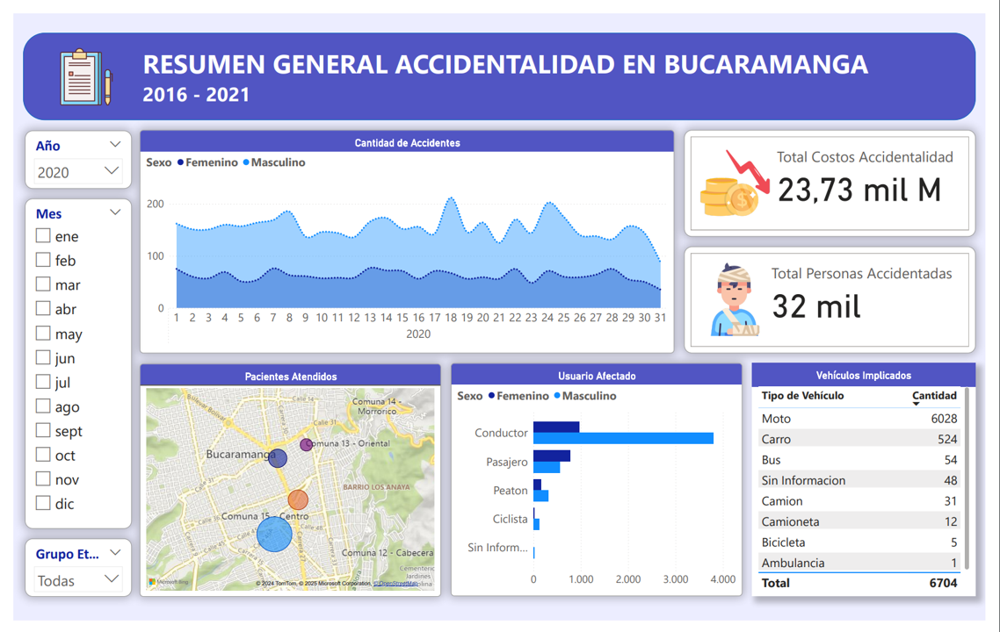
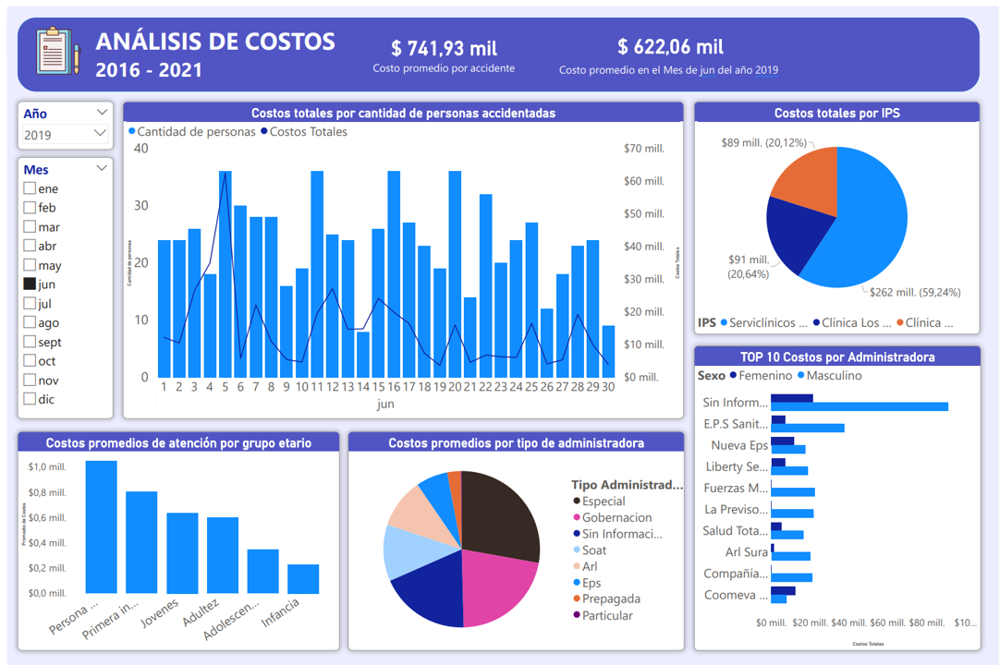
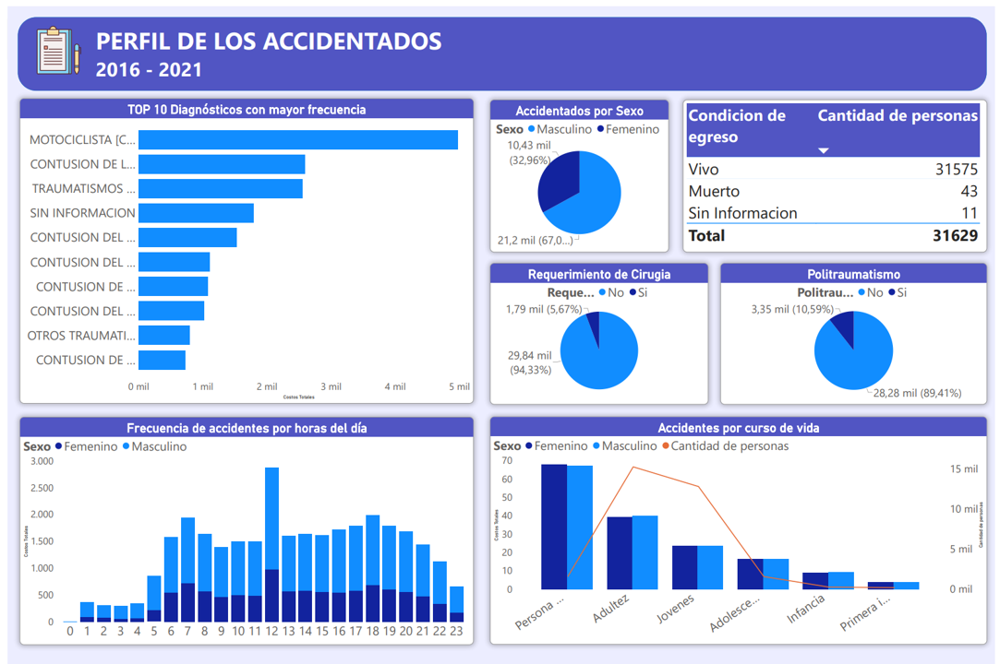
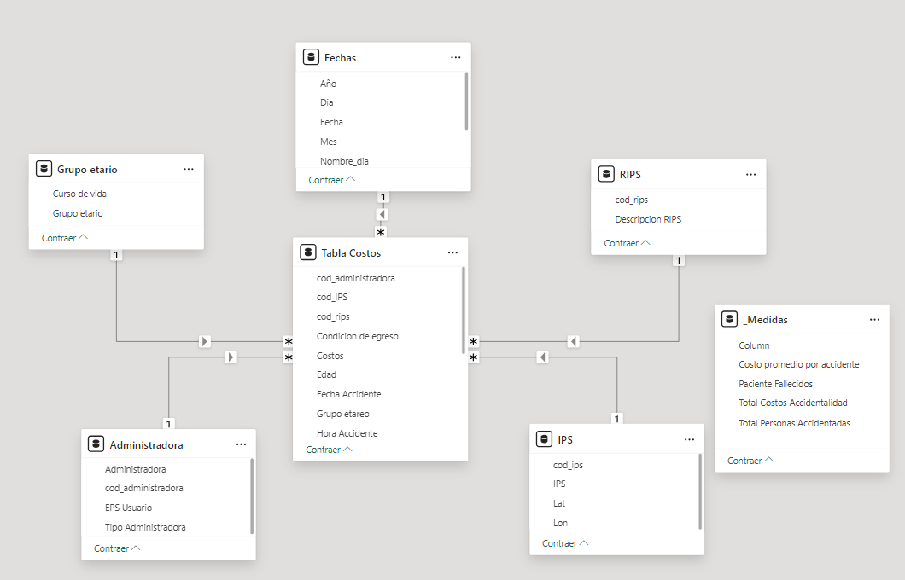

# 📊 Dashboard Costos de atención hospitalaria en Bucaramanga

## 📌 Descripción general

Este proyecto ofrece un análisis detallado de los costos de la atención hospitalaria por los accidentes en Bucaramanga , abarcando el periodo desde enero de 2016 hasta noviembre de 2021. Cada sección del informe está diseñada para proporcionar una visión clara y precisa de las diferentes variables que afectan los costos en el sector salud.

**Te invito a que consultes el Panel de Power BI en el siguiente enlace:**

## 💾 Dataset

La información fue extraída de **Datos Abiertos**. Puedes consultar la información en:

https://www.datos.gov.co/Salud-y-Protecci-n-Social/Costos-de-la-atenci-n-hospitalaria-en-Bucaramanga-/g4vd-w4ip/about_data

## 📝 Resumen General

El proyecto sobre los costos hospitalarios de atención a los accidentados en Bucaramanga ofrece un análisis detallado y crítico del impacto económico de los siniestros de tránsito en la atención médica. Utilizando datos recopilados de diversas fuentes, este estudio proporciona información valiosa para mejorar la gestión de recursos en el sector salud.
 
## 📍Características Principales:

- **Desbloqueo de Información:** Este análisis permite a los tomadores de decisiones acceder a información clave sobre los costos asociados a los de atención hospitalaria, proporcionando una base sólida para la formulación de políticas y estrategias en el ámbito de la salud.

- **Medidas DAX:** A través del lenguaje DAX, se calculan métricas relevantes que reflejan el impacto económico de los servicios hospitalarios.

- **Limpieza y Transformación de Datos:** Se implementan rigurosos procesos para asegurar la calidad y consistencia de los datos, garantizando que la información presentada sea precisa y esté lista para el análisis. Esto es fundamental para mantener la integridad del estudio.

- **Visualizaciones Interactivas:** Las visualizaciones interactivas permiten a los usuarios explorar los datos de manera dinámica. Esto incluye filtros que facilitan el análisis de tendencias a lo largo del tiempo y la evaluación de diferentes escenarios, apoyando así una toma de decisiones más informada y estratégica.

## 🎯 Insights

| Resumen General |
|-------------|
|  | 
| Esta sección proporciona un resumen conciso pero completo de ideas y hallazgos clave derivados del análisis de los costos hospitalarios de los accidentes de la ciudad de Bucaramanga entre 2016 y 2021 |

---

| Análisis de Costos |
| ---------------- |
|  |
| Este análisis proporciona una visión completa de los costos hospitalarios asociados a la accidentalidad en Bucaramanga, centrándose en las métricas clave que impactan tanto a las instituciones de salud como a los administradores de atención médica.|

---

| Perfil de los accidentados |
|-------|
|  | 
| Este análisis presenta un perfil detallado de los accidentados en Bucaramanga, proporcionando información valiosa para mejorar la atención médica y las intervenciones en salud. Se examinan diversas variables demográficas y clínicas que permiten entender mejor las características de los pacientes involucrados en siniestros de tránsito. |

---

## 📚  Modelo Entidad Relación

| Modelo en Power BI |
|-------|
|  | 
| Diagrama del modelo que ilustra la estructura y la relación entre los datos. |

---

## 🌟 Observaciones Finales

Este proyecto subraya la importancia del análisis de datos en el ámbito de la atención médica, especialmente en lo que respecta a la accidentalidad. Al ofrecer información detallada sobre los costos hospitalarios, se capacita a las partes interesadas para tomar decisiones basadas en datos, informando así tanto la accidentalidad como el impacto en los costes de la atención en los centros médicos en Bucaramanga. 

## 📝 Contacto

Si tienes comentarios y/o sugerencias me puedes escribir al correo electrónico:

camilocampillo07@gmail.com

Visita mi perfil de linkedIn

